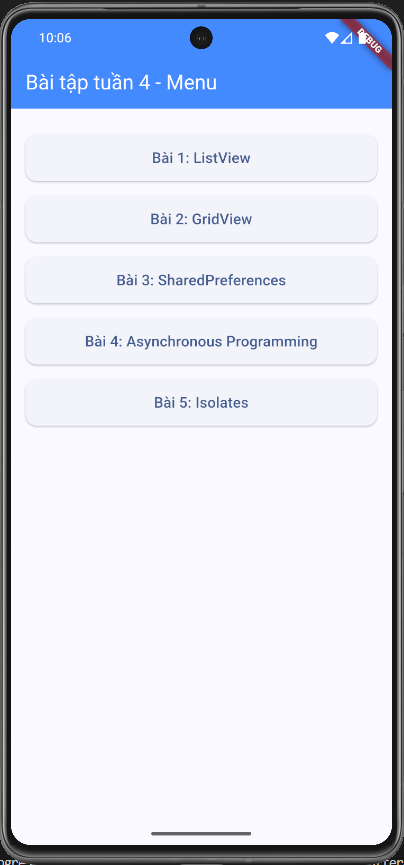
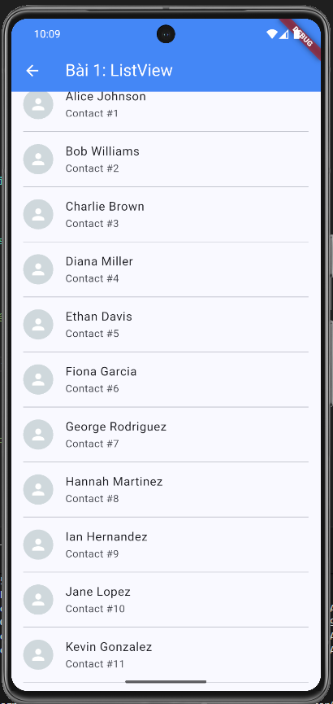
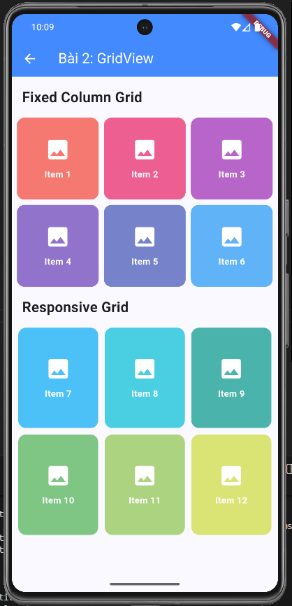
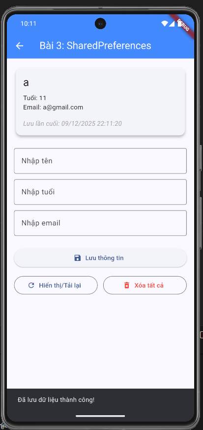
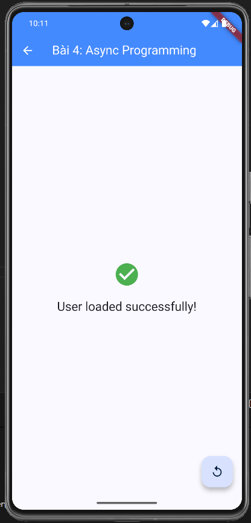
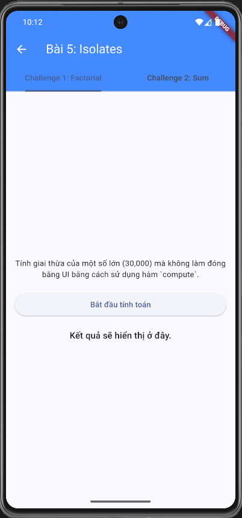
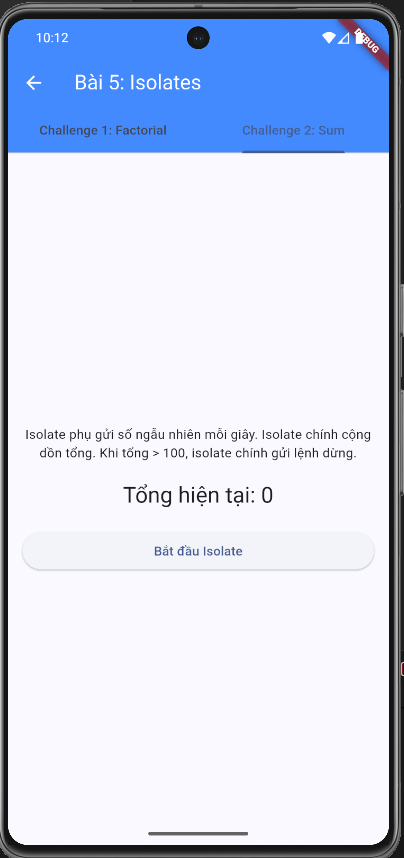

# Bài tập Flutter Tuần 4

Đây là một dự án Flutter bao gồm 5 bài tập nhỏ để thực hành các khái niệm cốt lõi trong Flutter. Mỗi bài tập được chứa trong một màn hình riêng và có thể truy cập từ một menu chính.

## 🎬 Video Demo
Xem video demo của ứng dụng tại đây:
**https://drive.google.com/drive/folders/1NAeAnroMp3gKMiZ0HZIQeDdoGenPDoKs?usp=sharing**

## Cấu trúc dự án

Dự án được tổ chức như sau:

-   `lib/main.dart`: Điểm bắt đầu của ứng dụng. Tệp này chứa `MyApp` (widget gốc) và `MainMenuScreen` để điều hướng đến các bài tập.
-   `lib/screens/`: Thư mục chứa các tệp Dart cho từng màn hình bài tập.
    -   `exercise_1_listview.dart`: Bài 1 - Sử dụng `ListView`.
    -   `exercise_2_gridview.dart`: Bài 2 - Sử dụng `GridView`.
    -   `exercise_3_shared_prefs.dart`: Bài 3 - Lưu trữ dữ liệu với `SharedPreferences`.
    -   `exercise_4_async.dart`: Bài 4 - Lập trình bất đồng bộ.
    -   `exercise_5_isolates.dart`: Bài 5 - Xử lý đa luồng với `Isolates`.
-   `lib/utils/`: Chứa các tệp trợ giúp, ví dụ như `isolate_helpers.dart` cho Bài 5.
-   `screenshots/`: Thư mục chứa hình ảnh chụp màn hình của ứng dụng (bạn cần tự tạo thư mục này và thêm ảnh).

## Mô tả các bài tập

|  |

### Bài 1: ListView

-   **Mô tả:** Hiển thị một danh sách các liên hệ sử dụng `ListView.separated`. Mỗi item trong danh sách bao gồm avatar, tên, và một subtitle. Có dải phân cách giữa các item. Khi nhấn vào một item, một `SnackBar` sẽ hiện lên với tên của liên hệ đó.
-   **Kỹ thuật chính:** `ListView.separated`, `ListTile`, `CircleAvatar`, `SnackBar`.

|  |

### Bài 2: GridView

-   **Mô tả:** Trình bày hai loại `GridView` khác nhau trong một màn hình cuộn được bằng `CustomScrollView`.
    1.  `GridView` với số cột cố định (`SliverGridDelegateWithFixedCrossAxisCount`).
    2.  `GridView` đáp ứng (responsive) với chiều rộng tối đa cho mỗi item (`SliverGridDelegateWithMaxCrossAxisExtent`).
-   **Kỹ thuật chính:** `CustomScrollView`, `Slivers`, `SliverGrid`, `SliverGridDelegateWithFixedCrossAxisCount`, `SliverGridDelegateWithMaxCrossAxisExtent`.

|  |

### Bài 3: SharedPreferences

-   **Mô tả:** Một ứng dụng cho phép người dùng nhập, lưu, tải, và xóa thông tin cá nhân (tên, tuổi, email). Dữ liệu được lưu trữ cục bộ trên thiết bị ngay cả khi ứng dụng đã đóng. Thời gian lưu cuối cùng cũng được hiển thị.
-   **Kỹ thuật chính:** `SharedPreferences`, `TextEditingController`, `StatefulWidget`, `async/await`.

|  |

### Bài 4: Asynchronous Programming

-   **Mô tả:** Mô phỏng một tác vụ bất đồng bộ (ví dụ: tải dữ liệu người dùng từ mạng). Màn hình sẽ hiển thị một `CircularProgressIndicator` trong 3 giây, sau đó cập nhật giao diện để thông báo tác vụ đã hoàn thành. Người dùng có thể chạy lại tác vụ bằng `FloatingActionButton`.
-   **Kỹ thuật chính:** `Future`, `Future.delayed`, `async/await`, `StatefulWidget`, `setState`.

|  |

### Bài 5: Isolates

-   **Mô tả:** Trình bày hai cách sử dụng `Isolate` để thực hiện các tác vụ nặng mà không làm đóng băng giao diện người dùng (UI).
    1.  **Challenge 1:** Sử dụng hàm `compute` để tính giai thừa của một số rất lớn trên một isolate riêng.
    2.  **Challenge 2:** Tạo một `Isolate` thủ công để gửi các số ngẫu nhiên về luồng chính. Luồng chính sẽ cộng dồn các số này và gửi tín hiệu dừng khi tổng vượt quá 100.
-   **Kỹ thuật chính:** `Isolate`, `compute`, `ReceivePort`, `SendPort`, `Stream`.

|  |  |

## Bắt đầu

Để chạy dự án này:

1.  Clone repository.
2.  Chạy `flutter pub get` để cài đặt các dependency.
3.  Kết nối một thiết bị hoặc khởi động một emulator.
4.  Chạy `flutter run`.

Bạn sẽ thấy màn hình menu chính, từ đó có thể điều hướng đến từng bài tập.

